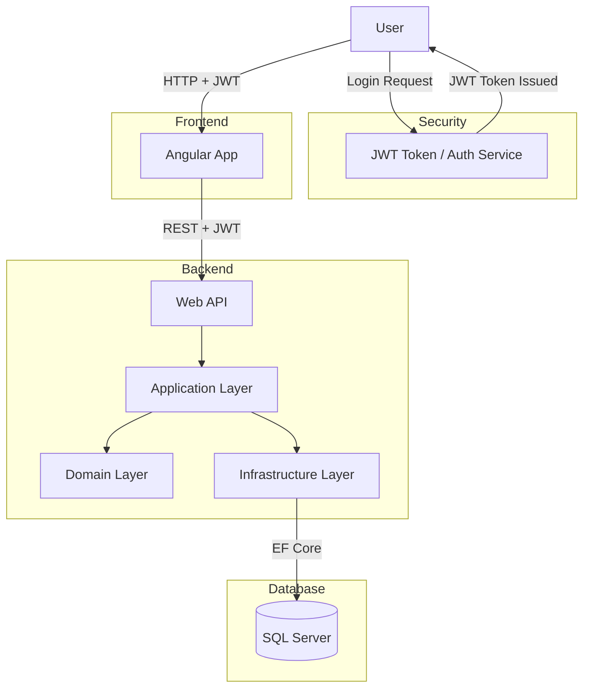

# Tech Stack

### Backend
- .NET 8
- Entity Framework Core
- MS SQL Server

### Frontend
- Angular 20

### Infrastructure
- Docker

# Getting started
## Prerequisites

Make sure you have the following installed

- .NET 8 SDK
- Node JS
- Angular CLI
- Docker

## Running the Application with Docker

1. Clone the Repository

```
git clone https://github.com/olga-91/focus-flow
cd focus-flow
```

2. Start the Application

```
cd Api
docker-compose up --build
```

3. Access the app
- Frontend: http://localhost:4200
- API: http://localhost:5174/api
- Swagger: http://localhost:5174/swagger

## Running Locally (Without Docker)
### Backend

```
cd Api
dotnet restore
dotnet run
```

### Frontend

```
cd client-app
npm install
ng serve
```

# Testing
- Unit tests (NUnit)

```
cd Tests
dotnet test
```

# Architectural Diagram

